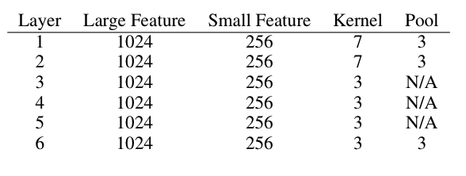

# DJL Malicious URL Detector Model Demo

## Introduction

This repository is a Demo application, built using [Deep Java Library(DJL)](https://github.com/awslabs/djl). The application, detects malicious url based on a trained [Character Level CNN model](https://arxiv.org/abs/1509.01626).

We use a dataset that is a amalgamation of the following malicious URL databases.

Benign

1. Custom automated webscraping of Alexa Top 1M with recursive depth of scraping of level 1.
2. Custom entries of our own

Malicious

1. Various blacklists
2. openphish
3. phishtank
4. public GitHub faizann24
5. Some custom entries of our own.

The dataset is an extension of Dataset found at [this repository](https://github.com/incertum/cyber-matrix-ai/tree/master/Malicious-URL-Detection-Deep-Learning).

## Model architecture

The model has toe following architecture

```
  (0): Conv1D(None -> 256, kernel_size=(7,), stride=(1,))
  (1): MaxPool1D(size=(3,), stride=(3,), padding=(0,), ceil_mode=False)
  (2): Conv1D(None -> 256, kernel_size=(7,), stride=(1,))
  (3): MaxPool1D(size=(3,), stride=(3,), padding=(0,), ceil_mode=False)
  (4): Conv1D(None -> 256, kernel_size=(3,), stride=(1,))
  (5): Conv1D(None -> 256, kernel_size=(3,), stride=(1,))
  (6): Conv1D(None -> 256, kernel_size=(3,), stride=(1,))
  (7): Conv1D(None -> 256, kernel_size=(3,), stride=(1,))
  (8): MaxPool1D(size=(3,), stride=(3,), padding=(0,), ceil_mode=False)
  (9): Flatten
  (10): Dense(None -> 1024, Activation(relu))
  (11): Dropout(p = 0.5)
  (12): Dense(None -> 1024, Activation(relu))
  (13): Dropout(p = 0.5)
  (14): Dense(None -> 2, linear)

```
There are 2 output classification labels as shown above, either benign or malicious.

The general model structure is based out of the [Character CNNs paper's](https://arxiv.org/abs/1509.01626) model description.

 


## Running the Proxy Server to detect malicious URLs

We have writen a simple proxy server, that can work with browsers, to detect malicious URLs. This demo example does not cache requests. However acts like a filter of malicious URLs, I works with both HTTP and HTTPs requests.

To run the example copy over the per-trained parameters file under the [parameters directory](trained_parameters/) to the ``` src/main/resources``` directory using.

```bash
# Copy pre-trained parameters for inference
$ cp trained_parameters/*.params src/main/resources/
```

Run the proxy server using the following command in terminal.

```bash
$ ./gradlew run
```
Which should start the server listening at port 8085.
```bash
> Task :run
[main] INFO com.example.FilterProxy - Waiting for client on port 8085..
```
In your browser settings (We use firefox as example), set the proxy settings to 127.0.0.1:8085


Now we can try a wrongly spelt URL of amazon.com in the browser navigator and see the proxy at work


The proxy server prints the following on the terminal screen.
```bash
> Task :run
[main] INFO com.example.FilterProxy - Waiting for client on port 8085..
[Thread-1] INFO com.example.RequestHandler - Request Received GET http://amazom.com/ HTTP/1.1
[Thread-1] INFO com.example.RequestHandler - Blocked site : http://amazom.com/
```

Typing the correct URL should show the correct website.
    

That is it for the inference demo.

## Train model on command line

To train the model, A GPU instance is recommended. CPU works, But is very slow compared to a GPU run of the train loop

In the build.gradle enable the GPU runtime of mxnet

```groovy
runtime "ai.djl.mxnet:mxnet-native-cu101mkl:1.6.0:linux-x86_64"
//comment out the CPU runtime
```

Run the following in command line

```bash
$./gradle train

> Task :train
[main] INFO com.example.ModelTrainer - Loading Dataset
[main] INFO com.example.ModelTrainer - Initialize Trainer
[02:17:17] src/operator/nn/./cudnn/cudnn_pooling-inl.h:375: 1D pooling is not supported by cudnn, MXNet 1D pooling is applied.
[main] INFO com.example.ModelTrainer - Begin Training
[02:17:18] src/operator/nn/./cudnn/./cudnn_algoreg-inl.h:97: Running performance tests to find the best convolution algorithm, this can take a while... (set the environment variable MXNET_CUDNN_AUTOTUNE_DEFAULT to 0 to disable)
Training:    100% |████████████████████████████████████████| accuracy: 0.73 loss: 0.53 speed: 1734.70 urls/sec
Validating:  100% |████████████████████████████████████████|
[main] INFO com.example.ModelTrainer - Epoch 0 finished.
[main] INFO com.example.ModelTrainer - train accuracy: 0.7282877, train loss: 0.52515125
[main] INFO com.example.ModelTrainer - validate accuracy: 0.7402341, validate loss: 0.56785536
Training:    100% |████████████████████████████████████████| accuracy: 0.84 loss: 0.36 speed: 1741.51 urls/sec
Validating:  100% |████████████████████████████████████████|
[main] INFO com.example.ModelTrainer - Epoch 1 finished.
[main] INFO com.example.ModelTrainer - train accuracy: 0.8411242, train loss: 0.36307296
[main] INFO com.example.ModelTrainer - validate accuracy: 0.7726503, validate loss: 0.541216
Training:    100% |████████████████████████████████████████| accuracy: 0.86 loss: 0.32 speed: 1755.39 urls/sec
Validating:  100% |████████████████████████████████████████|
[main] INFO com.example.ModelTrainer - Epoch 2 finished.
[main] INFO com.example.ModelTrainer - train accuracy: 0.8616253, train loss: 0.31982687
[main] INFO com.example.ModelTrainer - validate accuracy: 0.8153842, validate loss: 0.42479417
Training:    100% |████████████████████████████████████████| accuracy: 0.88 loss: 0.29 speed: 1547.37 urls/sec
Validating:  100% |████████████████████████████████████████|
[main] INFO com.example.ModelTrainer - Epoch 3 finished.
[main] INFO com.example.ModelTrainer - train accuracy: 0.87562, train loss: 0.2914456
[main] INFO com.example.ModelTrainer - validate accuracy: 0.8426159, validate loss: 0.3691258
Training:    100% |████████████████████████████████████████| accuracy: 0.89 loss: 0.27 speed: 1766.33 urls/sec
Validating:  100% |████████████████████████████████████████|
[main] INFO com.example.ModelTrainer - Epoch 4 finished.
[main] INFO com.example.ModelTrainer - train accuracy: 0.88663095, train loss: 0.26910067
[main] INFO com.example.ModelTrainer - validate accuracy: 0.83453107, validate loss: 0.3761223
Training:    100% |████████████████████████████████████████| accuracy: 0.90 loss: 0.25 speed: 1764.38 urls/sec
Validating:  100% |████████████████████████████████████████|
[main] INFO com.example.ModelTrainer - Epoch 5 finished.
[main] INFO com.example.ModelTrainer - train accuracy: 0.89527416, train loss: 0.24976254
[main] INFO com.example.ModelTrainer - validate accuracy: 0.8775217, validate loss: 0.28764376
Training:    100% |████████████████████████████████████████| accuracy: 0.90 loss: 0.23 speed: 1778.58 urls/sec
Validating:  100% |████████████████████████████████████████|
[main] INFO com.example.ModelTrainer - Epoch 6 finished.
[main] INFO com.example.ModelTrainer - train accuracy: 0.90326285, train loss: 0.23195234
[main] INFO com.example.ModelTrainer - validate accuracy: 0.86032546, validate loss: 0.33043325
Training:    100% |████████████████████████████████████████| accuracy: 0.91 loss: 0.21 speed: 1747.46 urls/sec
Validating:  100% |████████████████████████████████████████|
[main] INFO com.example.ModelTrainer - Epoch 7 finished.
[main] INFO com.example.ModelTrainer - train accuracy: 0.9120857, train loss: 0.2143221
[main] INFO com.example.ModelTrainer - validate accuracy: 0.8480314, validate loss: 0.34760192
Training:    100% |████████████████████████████████████████| accuracy: 0.92 loss: 0.20 speed: 1789.17 urls/sec
Validating:  100% |████████████████████████████████████████|
[main] INFO com.example.ModelTrainer - Epoch 8 finished.
[main] INFO com.example.ModelTrainer - train accuracy: 0.91793126, train loss: 0.19966042
[main] INFO com.example.ModelTrainer - validate accuracy: 0.8967969, validate loss: 0.24789414
Training:    100% |████████████████████████████████████████| accuracy: 0.92 loss: 0.18 speed: 1708.66 urls/sec
Validating:  100% |████████████████████████████████████████|
[main] INFO com.example.ModelTrainer - Epoch 9 finished.
[main] INFO com.example.ModelTrainer - train accuracy: 0.92416185, train loss: 0.18444999
[main] INFO com.example.ModelTrainer - validate accuracy: 0.8903034, validate loss: 0.27242142
```

For re-running inference, copy the ```.params``` file ```src\main\resources\``` folder.

## More Reading

This repository also contains documentation regarding how to rain the model using DJL, writing Datasets and how to use Translators. Here are some links to them

1. [Creating a Dataset to read in from the CSV file](docs/dataset_creation.md)
2. [Creating an imperative model in DJL.](docs/define_model.md)
3. [Training Model using DJL and imperative model.](docs/training_model.md)
4. [Writing Translators, to handle pre-process and post-process during inference.](docs/translators.md)

## License

This project is licensed under the Apache-2.0 License.


