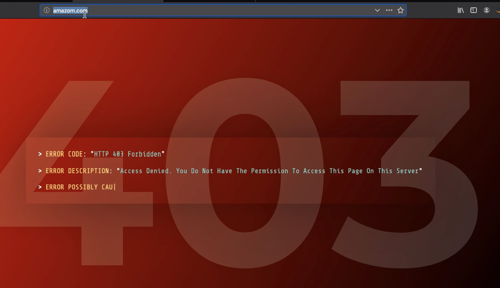

# DJL Malicious URL Detector Model Demo

## Introduction

This repository is a Demo application, built using [Deep Java Library(DJL)](https://github.com/awslabs/djl). The application, detects malicious url based on a trained [Character Level CNN model](https://arxiv.org/abs/1509.01626).

We use a dataset that is a amalgamation of the following malicious URL databases.

Benign

1. Custom automated webscraping of Alexa Top 1M with recursive depth of scraping of level 1.
2. Custom entries of our own

Malicious

1. Various blacklists
2. openphish
3. phishtank
4. public GitHub faizann24
5. Some custom entries of our own.

The dataset is an extension of Dataset found at [this repository](https://github.com/incertum/cyber-matrix-ai/tree/master/Malicious-URL-Detection-Deep-Learning).

## Model architecture

The model has toe following architecture

```
  (0): Conv1D(None -> 256, kernel_size=(7,), stride=(1,))
  (1): MaxPool1D(size=(3,), stride=(3,), padding=(0,), ceil_mode=False)
  (2): Conv1D(None -> 256, kernel_size=(7,), stride=(1,))
  (3): MaxPool1D(size=(3,), stride=(3,), padding=(0,), ceil_mode=False)
  (4): Conv1D(None -> 256, kernel_size=(3,), stride=(1,))
  (5): Conv1D(None -> 256, kernel_size=(3,), stride=(1,))
  (6): Conv1D(None -> 256, kernel_size=(3,), stride=(1,))
  (7): Conv1D(None -> 256, kernel_size=(3,), stride=(1,))
  (8): MaxPool1D(size=(3,), stride=(3,), padding=(0,), ceil_mode=False)
  (9): Flatten
  (10): Dense(None -> 1024, Activation(relu))
  (11): Dropout(p = 0.5)
  (12): Dense(None -> 1024, Activation(relu))
  (13): Dropout(p = 0.5)
  (14): Dense(None -> 2, linear)

```
There are 2 output classification labels as shown above, either benign or malicious.

The general model structure is based out of the [Character CNNs paper's](https://arxiv.org/abs/1509.01626) model description.

 


## Running the Proxy Server to detect malicious URLs

We have writen a simple proxy server, that can work with browsers, to detect malicious URLs. This demo example does not cache requests. However acts like a filter of malicious URLs, I works with both HTTP and HTTPs requests.

To run the example copy over the per-trained parameters file under the [parameters directory](trained_parameters/) to the ``` src/main/resources``` directory using.

```bash
# Copy pre-trained parameters for inference
$ cp trained_parameters/*.params src/main/resources/
```

Run the proxy server using the following command in terminal.

```bash
$ ./gradlew run
```
Which should start the server listening at port 8085.
```bash
> Task :run
[main] INFO com.example.FilterProxy - Waiting for client on port 8085..
```
In your browser settings (We use firefox as example), set the proxy settings to 127.0.0.1:8085


Now we can try a wrongly spelt URL of amazon.com in the browser navigator and see the proxy at work



The proxy server prints the following on the terminal screen.
```bash
> Task :run
[main] INFO com.example.FilterProxy - Waiting for client on port 8085..
[Thread-1] INFO com.example.RequestHandler - Request Received GET http://amazom.com/ HTTP/1.1
[Thread-1] INFO com.example.RequestHandler - Blocked site : http://amazom.com/
```

Typing the correct URL should show the correct website.
    

That is it for the inference demo.

## More Reading

This repository also contains documentation regarding how to rain the model using DJL, writing Datasets and how to use Translators. Here are some links to them

1. [Creating a Dataset to read in from the CSV file](docs/dataset_creation.md)
2. [Creating an imperative model in DJL.](docs/define_model.md)
3. [Training Model using DJL and imperative model.](docs/training_model.md)
4. [Writing Translators, to handle pre-process and post-process during inference.](docs/translators.md)

## License

This project is licensed under the Apache-2.0 License.


